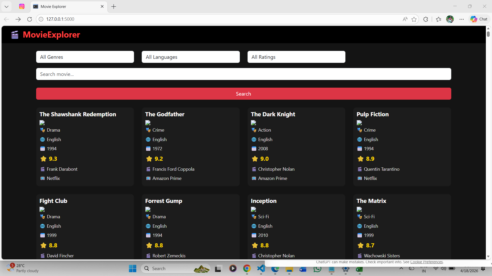
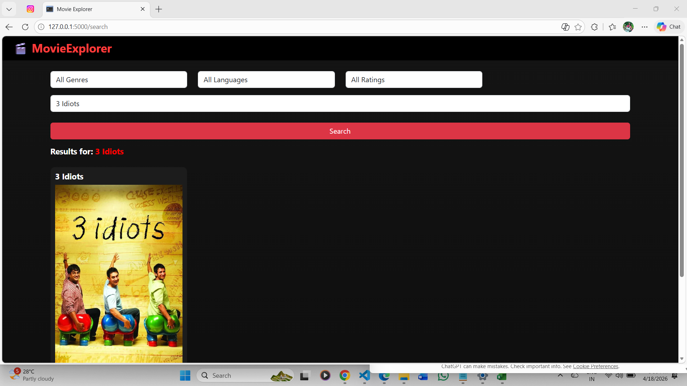
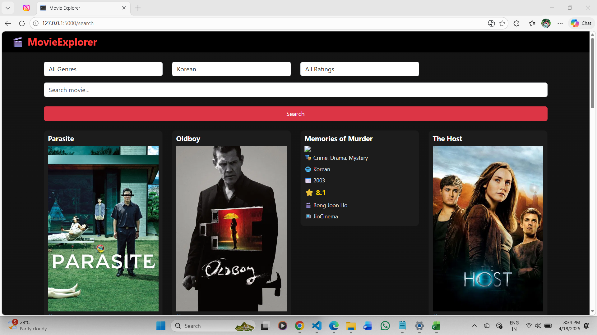
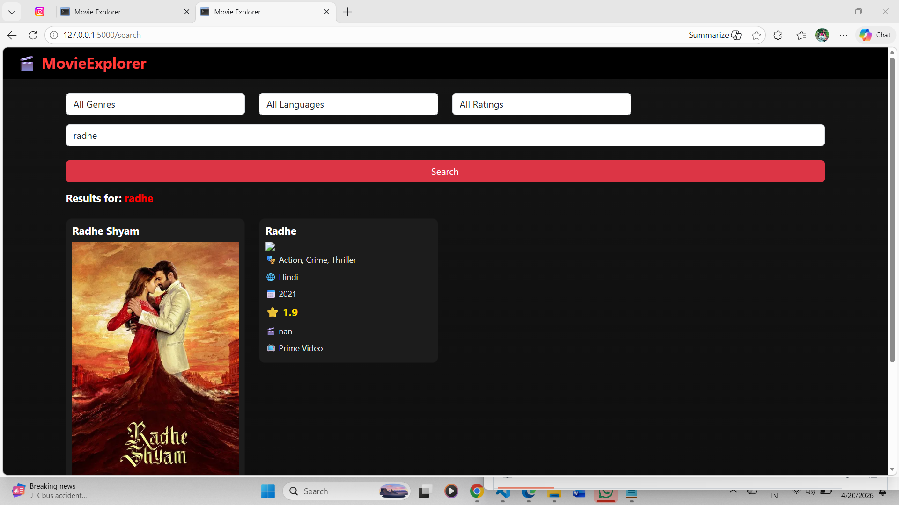

# 🎬 Movie Explorer AI System

A web-based movie recommendation and search system using Flask and Machine Learning.

## 🚀 Features
- Movie search
- Filter by genre, language, rating
- Recommendation system (TF-IDF + Cosine Similarity)
- Movie posters using TMDB API
- Responsive UI

## 🛠 Technologies
- Python
- Flask
- Pandas
- Scikit-learn
- Bootstrap

## ▶️ Run Project
pip install -r requirements.txt
python app.py

## 📸 Screenshots

.png)

